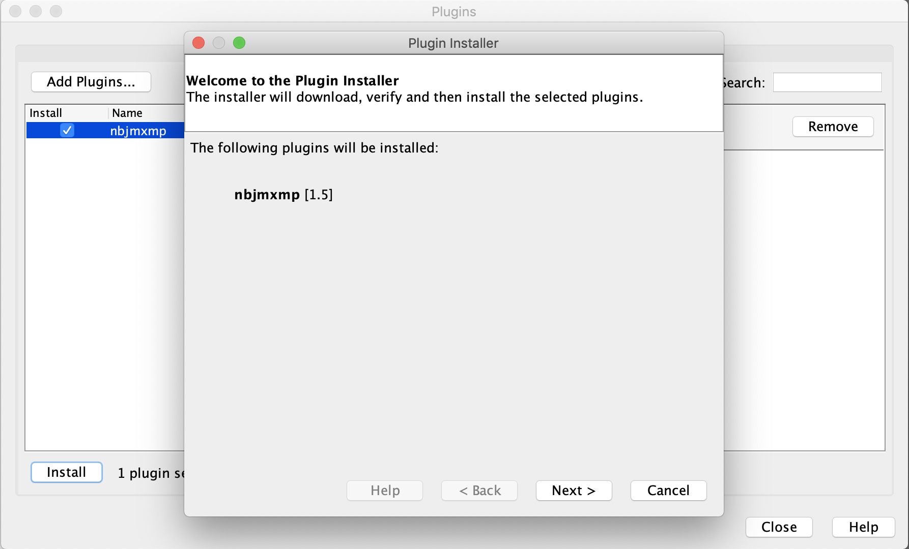

# VisualVM JMXMP plugin

This VisualVM plugin add support for JMXMP with SASL login/password authentication.
It allows to monitor Kubernetes pods running a JVM through a single port-forwarded connection.

## Build

```bash
mvn clean package
```

## Usage

Start VisualVM with the following system properties:

```bash
visualvm 
    -cp:a /path/to/jmxremote_optional-repackaged-5.1.jar 
    -J-Djavax.net.ssl.trustStore=truststore.jks 
    -J-Djavax.net.ssl.trustStorePassword=changeit 
    -J-Djavax.net.ssl.trustStoreType=JKS 
    -J-Dcom.sun.management.jmxremote.registry.ssl=true
    -J-Djmxmp.username="cassandra"
    -J-Djmxmp.password="*********"
```

Install the JMXMP plugin for VisualVM:



Create a JMXMP connection:


Without **jmxmp.username** and **jmxmp.password**, visualVM prompts for a username and password.

