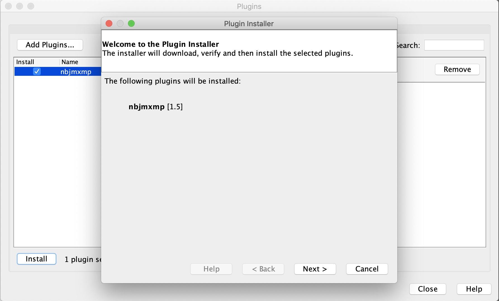
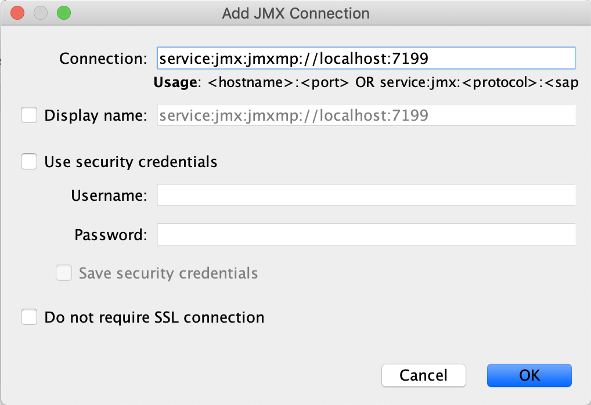
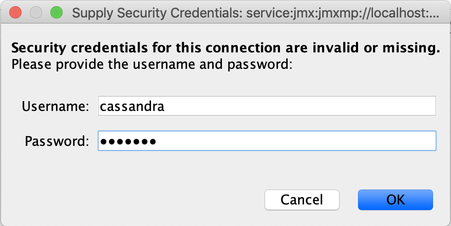

# VisualVM Secured JMXMP plugin

[](https://travis-ci.org/strapdata/visualvm-jmxmp)

This [VisualVM](https://visualvm.github.io/) plugin add support for [JMXMP](https://docs.oracle.com/cd/E19698-01/816-7609/connectors-116/index.html) 
secured with [SASL](https://docs.oracle.com/cd/E19698-01/816-7609/6mdjrf873/index.html) login/password authentication.

This plugin allows to plug VisualVM to a Kubernetes pods running a JVM through a JMXMP single port-forwarded connection.

**WARNING**: Oracle JMXMP implementation is vulnerable to a deserialization vulnerability (see [ACUNEXTIX Blog](https://www.acunetix.com/blog/web-security-zone/old-java-libraries/)),
so don't expose it to untrusted networks.

## Build

```bash
mvn clean package
```

## Usage

Start VisualVM with the following system properties:

```bash
visualvm 
    -cp:a /path/to/jmxremote_optional-repackaged-5.1.jar 
    -J-Djavax.net.ssl.trustStore=truststore.jks 
    -J-Djavax.net.ssl.trustStorePassword=changeit 
    -J-Djavax.net.ssl.trustStoreType=JKS
    -J-Djmxmp.username="cassandra"
    -J-Djmxmp.password="*********"
```

Install the JMXMP plugin for VisualVM:



Create a JMXMP connection:



Without **jmxmp.username** and **jmxmp.password**, visualVM prompts for a username and password.

